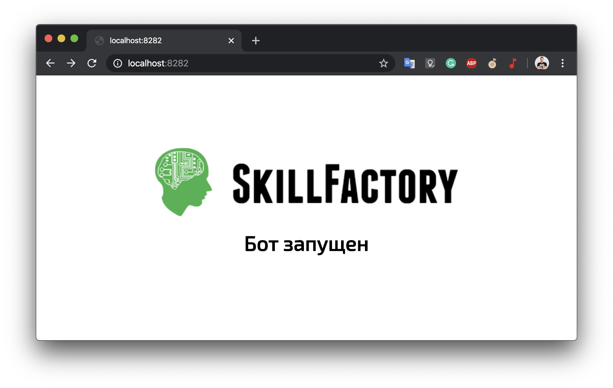

# Skillfactory Java OpenLesson 1804



## До урока нужно
- Скачать и установить jdk ([Oracle](https://www.oracle.com/java/technologies/javase-jdk13-downloads.html) или [OpenJdk](https://jdk.java.net/13/))
- Скачать и установить [IDEA](https://www.jetbrains.com/ru-ru/idea/download)

Установить переменные окружения `JAVA_HOME` и добавить ее в `PATH`
```
# Для Windows
set JAVA_HOME = C:\Program Files\Java\jdk13
# Для Linux
export JAVA_HOME=/usr/java/jdk13 /bin/java
# Для MacOS
export JAVA_HOME=$(/usr/libexec/java_home)
```

Результат, при выполнении команды в консоле вы должны будете увидеть подобный результат
```
sboychenko@macbook ~ % java --version 
java 11.0.6 2020-01-14 LTS
Java(TM) SE Runtime Environment 18.9 (build 11.0.6+8-LTS)
Java HotSpot(TM) 64-Bit Server VM 18.9 (build 11.0.6+8-LTS, mixed mode)
```

Далее скачайте этот репозиторий (можно сделать нажав на кнопку `Clone or download`)

Так же не забудьте зарядить свои ноутбуки, и обязательно захватите хорошее настроение

## Hello World
Начнем с азов. Создадим файл `HelloWorld.java`
```
class HelloWorld {
    public static void main(String[] args) {
        if (args.length == 1) {
            System.out.println("Hello " + args[0] + "!");
        } else {
            System.out.println("Hello World!")
        }
    }
}
```
Теперь скомпилируем и запустим его
```
javac HelloWorld.java
java HelloWorld
```
Работает? 
```
%  java HelloWorld 
Hello World! 
 %  java HelloWorld Sergey
Hello Sergey! 
```
Погнали дальше! :rocket:

## Telegram bot на Java
Начнем с идеи. Круто будет написать бота, который будет по запросу отдавать актуальный курс любой валюты?


Для этого нам понадобятся:
- Spring boot [Spring initializr](https://start.spring.io/)
- Для работы c telegram библиотека [Telegram Bot Java Library](https://github.com/rubenlagus/TelegramBots)
- Сервис для получения списка валют [CBR](https://www.cbr-xml-daily.ru/#json)
- И конечно же создать бота поможет [БатяБот (BotFather)](http://t.me/BotFather)


### Сборка проекта

Прописать в `application.properties` необходимые настройки
```
./mvn package
```
Собранный **jar** файл будет находиться в `./target`

### Запуск
После сборки находясь в директории проекта
```
java -jar ./target/demo-bot-0.0.1-SNAPSHOT.jar
```

Проверить статус приложения 
```
http://localhost:8282
http://localhost:8282/actuator
```
после запуска можно пользоваться ботом!


P.S.
>Тут много чего можно исправить, в процессе прохождения курса вы можете возвращаться и смотреть на код более осознано
>
>Исправить неидеальный код, добавить работу с БД, реализовать новые возможности.
>
>И много всего!

## Идеи для развития
- [x] Посетить открытый урок Skillfactory
- [ ] Изучить программирование на http://skillfactory.ru/java 
- [ ] Добавить возможность получить список валют
- [ ] Конвертировать валюты
- [ ] Добавить еще новых команд
- [ ] Сделать стартап и заработать `$1000000`