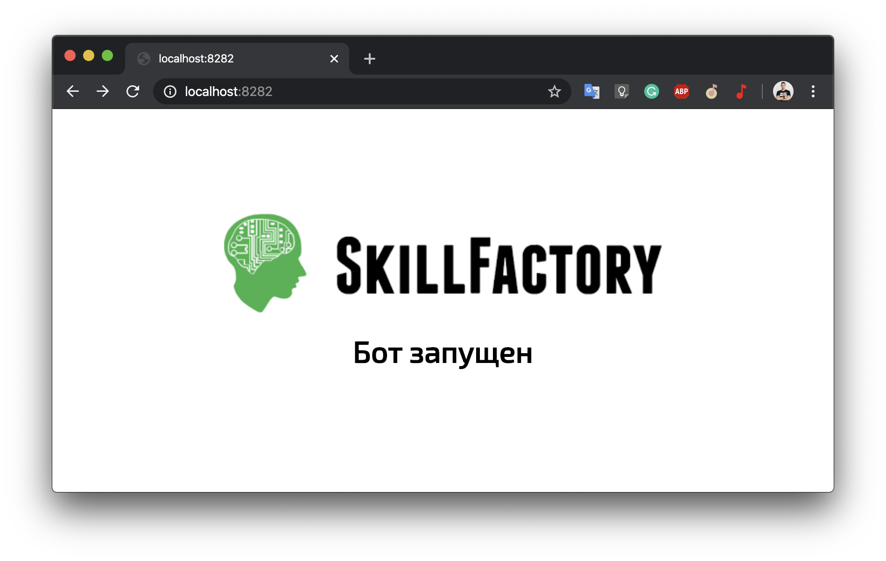

# Telegram bot на Java



Начнем с идеи. Круто будет написать бота, который будет по запросу отдавать актуальный курс любой валюты?


Для этого нам понадобятся:
- Spring boot [Spring initializr](https://start.spring.io/)
- Для работы c telegram библиотека [Telegram Bot Java Library](https://github.com/rubenlagus/TelegramBots)
- Сервис для получения списка валют [CBR](https://www.cbr-xml-daily.ru/#json)
- И конечно же создать бота поможет @BotFather [БатяБот](http://t.me/BotFather)


### Сборка проекта

Прописать в `application.properties` необходимые настройки
```
./mvn package
```
Собранный **jar** файл будет находиться в `./target`

### Запуск
После сборки находясь в директории проекта
```
java -jar ./target/demo-bot-0.0.1-SNAPSHOT.jar
```

Проверить статус приложения 
```
http://localhost:8282
http://localhost:8282/actuator
```
после запуска можно пользоваться ботом!


P.S.
>Тут много чего можно исправить, в процессе прохождения курса вы можете возвращаться и смотреть на код более осознано
>
>Исправить неидеальный код, добавить работу с БД, реализовать новые возможности.
>
>И много всего!

## Идеи для развития
- [x] Посетить открытый урок Skillfactory
- [ ] Изучить программирование на http://skillfactory.ru/java 
- [ ] Добавить возможность получить список валют
- [ ] Конвертировать валюты
- [ ] Добавить еще новых команд
- [ ] Сделать стартап и заработать `$1000000`
