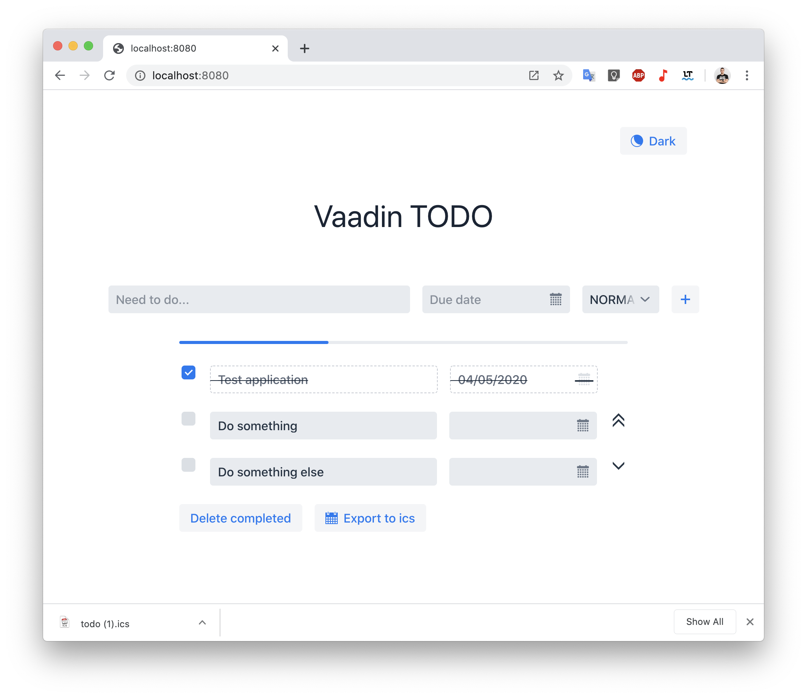

# Vaadin TODO



В проекте используются:
- Spring boot [Spring initializr](https://start.spring.io/)
- Spring Data + H2 [Link](https://spring.io/projects/spring-data)
- Vaadin 14 [Project starter](https://vaadin.com/start)
- Библиотека для работы c ics [ICAL4j](https://github.com/ical4j/ical4j)

### Сборка проекта

Vaadin c 14 версии использует для сборки `npm` нам нужно установить
```
Node js LTS
https://nodejs.org/en/
```

Прописать в `application.properties` необходимые настройки
```
./mvnw package
```
Собранный **jar** файл будет находиться в `./target`

### Запуск
После сборки находясь в директории проекта
```
java -jar ./target/vaadin-todo-0.0.1-SNAPSHOT.jar
```

Запустить приложение 
```
http://localhost:8080
```

P.S.
>Тут много чего можно исправить, в процессе прохождения курса вы можете возвращаться и смотреть на код более осознано
>
>Исправить неидеальный код, добавить работу с БД, реализовать новые возможности.
>
>И много всего!

## Идеи для развития
- [x] Посетить открытый урок Skillfactory
- [ ] Изучить программирование на http://skillfactory.ru/java 
- [ ] Добавить возможность работы для нескольких пользователей
- [ ] Сортировка и фильтрация
- [ ] Сделать стартап и заработать `$1000000`
